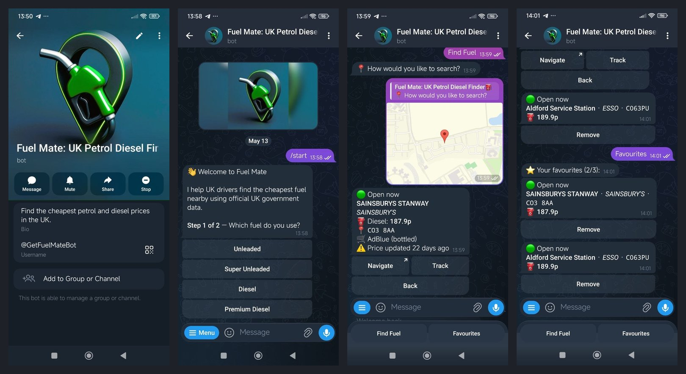
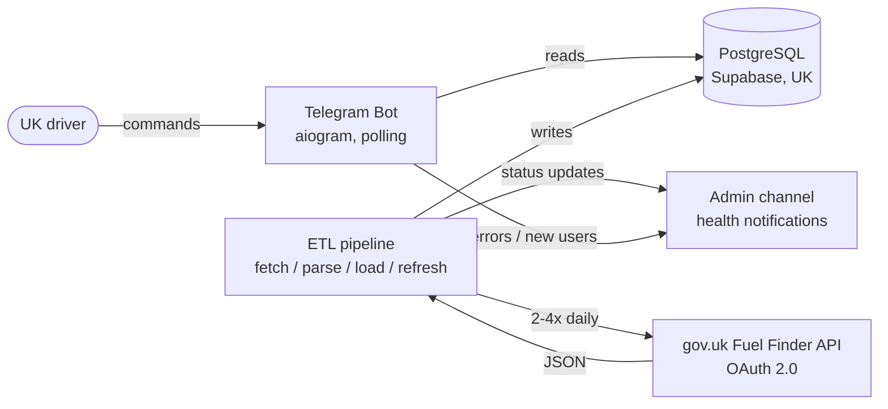
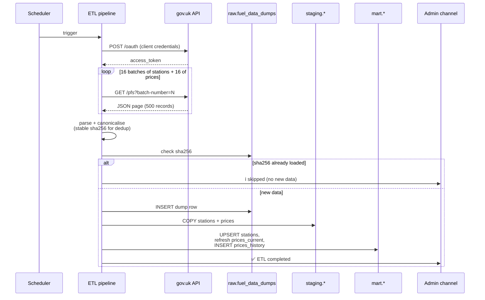

# Fuel Mate

> A Telegram bot that helps UK drivers find the cheapest petrol or diesel
> nearby, using official UK government data published by the Department
> for Energy Security & Net Zero.

[](https://www.python.org/downloads/)
[](#testing)
[](LICENSE)



**Try it:** [@GetFuelMateBot](https://t.me/GetFuelMateBot) on Telegram
(requires the Telegram app).

---

## What it does

UK fuel retailers are legally required to publish their pump prices in
near real-time. The data exists, but consumers see it through clunky
price-comparison websites. Fuel Mate puts the same data into a Telegram
chat:

- **Type a postcode** (or share your location) → get the 5 cheapest
  stations within a chosen radius.
- **One-tap navigation** opens the station in Google or Apple Maps.
- **Track up to 3 favourites** to keep an eye on stations you actually use.
- **Open now / 24/7 / closed** indicators based on each station's
  reported opening hours.

Designed to be simple, fast, and free — no ads, no account, no app
install beyond Telegram itself.

---

## Architecture



The bot and the ETL pipeline are **fully decoupled**. The bot reads from
materialised tables (`mart.stations`, `mart.prices_current`); the ETL
writes them. Either side can be redeployed without affecting the other.

### ETL data flow



### Database schemas

The PostgreSQL database uses four schemas to enforce a clean separation
between raw ingestion, validated rows, query-time data, and user state:

| Schema    | Purpose                                                   |
|-----------|-----------------------------------------------------------|
| `raw`     | Every fetch is logged here with its sha256 (for dedup)    |
| `staging` | Parsed but un-validated rows from the latest fetch        |
| `mart`    | Deduplicated, indexed tables the bot actually reads       |
| `app`     | User accounts, preferences, favourites                    |

This pattern (sometimes called the
[medallion architecture](https://www.databricks.com/glossary/medallion-architecture))
makes it easy to re-run the load step without re-fetching, or to roll
back to a previous good state by querying `raw`/`staging`.

---

## Engineering highlights

Six pieces of the codebase worth a closer look:

### 1. Source-agnostic ETL pipeline

The downloader (`etl/download.py`) and parser (`shared/csv_parser.py`)
support **two input modes** that produce the exact same
`ParsedStation` / `ParsedPrice` dataclasses:

- **OAuth API** (primary, production)
- **Local CSV file** (legacy + offline replay via `--local-csv`)

Everything downstream (`load_staging`, `refresh_mart`) is unaware of
which mode was used. Adding a third source (e.g. a different government
feed) would only require a new parser, not pipeline changes.

### 2. Atomic favourites with advisory locks

The `favourites.add()` repository function enforces a "max 3 per user"
rule. A naive `SELECT COUNT(*) FOR UPDATE` is not allowed in PostgreSQL
on an aggregated query, so the implementation uses
`pg_advisory_xact_lock($user_id)` to serialise concurrent inserts for
the same user within a transaction. Different users don't block each
other; the same user can't race past the limit.

### 3. Stable deduplication via canonical sha256

The gov.uk API may return batches in different orders, and the
`price_last_updated` field ticks even when nothing meaningful has
changed. To dedup honestly, the pipeline computes a sha256 over a
**sorted, canonicalised** representation of just the substantive fields:
`(station_id, fuel_type, price, effective_timestamp)`. Cosmetic
differences don't produce a new digest; real price changes always do.

### 4. WAF challenge → OAuth migration

The original gov.uk CSV endpoint was put behind an AWS WAF in early
2026, returning **HTTP 403** to all datacenter IPs (GitHub Actions
runners included). Diagnostic workflows confirmed the block was at the
network layer, not the auth layer.

The fix was a full migration to the official OAuth 2.0 client-credentials
API at `developer.fuel-finder.service.gov.uk` — a new client module
(`etl/api_client.py`) with paginated GETs, exponential-backoff retries,
401/403/429 handling, and end-of-pagination detection (a 404 with a
specific message body, not the typical "empty array" signal).

This migration also surfaced (and required handling for) several
real-world API quirks: the production token response omits
`refresh_token_expires_in` despite the docs claiming otherwise; the
documentation's `fuel_types` object is actually an array in production;
`B7_Standard` in docs is `B7_STANDARD` in real responses.
Defensive parsing throughout.

### 5. UK postcode index in memory

There are ~1.8M postcodes in the UK. To resolve a postcode to lat/long
without an external API call (and the rate limit that comes with it),
the bot loads a gzipped CSV at startup into a hash map. **16 MB on
disk, ~250 MB in RAM**, and lookups are O(1). This is a deliberate
trade-off: a small RAM bump (well within Railway's $5/month Hobby tier)
for zero external dependencies and instant response.

### 6. JSONB codec registration for asyncpg

`asyncpg` by default returns JSONB columns as raw strings. The bot's
`opening_hours` and `amenities` columns are heavily used as dicts, so
every connection registers `json.loads`/`json.dumps` codecs via the
`init=` parameter of `asyncpg.create_pool()`. The code is unaware that
JSONB is anything other than a Python dict.

---

## Tech stack

| Layer            | Technology                                    |
|------------------|-----------------------------------------------|
| Language         | Python 3.12                                   |
| Bot framework    | [aiogram 3.13](https://github.com/aiogram/aiogram) (async) |
| DB driver        | [asyncpg](https://github.com/MagicStack/asyncpg) (no ORM, raw SQL) |
| HTTP client      | [httpx](https://www.python-httpx.org/) (async)|
| Database         | PostgreSQL 15 on Supabase (UK region)         |
| Bot host         | Railway (Hobby plan)                          |
| ETL trigger      | GitHub Actions cron *(currently manual — see note below)* |
| External API     | gov.uk Fuel Finder API (OAuth 2.0)            |
| Testing          | pytest + pytest-asyncio                       |

---

## Project status

**Production-ready MVP.** Live and serving users.

| Component           | Status                                              |
|---------------------|-----------------------------------------------------|
| Bot in Telegram     | ✅ Live 24/7 on Railway                            |
| Database            | ✅ Hosted on Supabase, ~7,800 stations indexed      |
| ETL pipeline        | ✅ Working, **manual trigger** *(see note)*         |
| Admin notifications | ✅ Telegram channel for health alerts               |
| Unit tests          | ✅ 101 passing, 1 skipped                          |
| Push alerts         | ⏳ Planned (price changes for tracked favourites)   |
| Daily admin summary | ⏳ Planned (signups, retention, error rate)         |

> **Note on the ETL trigger.** The original plan was to run the ETL on
> a GitHub Actions cron schedule. The gov.uk API's WAF blocks all
> datacenter IP ranges (AWS, Azure, GCP) — including GitHub-hosted
> runners. Three workarounds are viable: a self-hosted GitHub Actions
> runner on a residential IP, a small non-AWS VPS, or a Cloudflare
> Worker proxy. For now the ETL is run manually 1-2× per day; choosing
> a permanent automation path is the next item on the roadmap.

---

## Repository layout

```
fuel-mate/
├── bot/                  # Telegram bot (aiogram handlers, repos, messages)
│   ├── handlers/         # /start, /find, /favourites, /settings, /help
│   ├── repositories/     # DB access — one file per aggregate
│   └── main.py           # Polling entrypoint
├── etl/                  # Fetch · parse · load · refresh pipeline
│   ├── api_client.py     # OAuth 2.0 + paginated GETs to gov.uk
│   ├── download.py       # Routes between API and local-CSV modes
│   ├── load_staging.py   # asyncpg COPY into staging tables
│   ├── refresh_mart.py   # Materialises mart tables from staging
│   └── pipeline.py       # Stage orchestrator + admin notifications
├── shared/               # Used by both bot and ETL
│   ├── csv_parser.py     # JSON-API and legacy-CSV parsers
│   ├── geo.py            # Haversine distance, bounding boxes
│   ├── postcode_validator.py
│   └── admin_notifier.py # HTTP client for the admin Telegram channel
├── sql/migrations/       # Versioned schema migrations
├── tests/                # 101 unit tests, mostly parser + repo + geo
├── data/postcodes.csv.gz # 1.8M UK postcodes, loaded at bot startup
└── .github/workflows/    # CI + scheduled ETL workflows
```

---

## Local development

Requirements: Python 3.12, a PostgreSQL instance (local Docker or
Supabase), Telegram bot credentials from [@BotFather](https://t.me/BotFather).

```bash
# Clone and enter
git clone https://github.com/KirillZentsov/fuel-mate.git
cd fuel-mate

# Virtualenv + dependencies (bot + ETL on separate requirements files
# to keep the bot container slim)
python -m venv venv
source venv/bin/activate          # Windows: venv\Scripts\activate
pip install -r requirements.txt -r requirements-etl.txt

# Configure
cp .env.example .env
# Then edit .env — see comments in the file for what each var means.

# Run the schema migrations
psql $DATABASE_URL -f sql/migrations/0001_extensions_and_schemas.sql
# ... continue with 0002 through 0006 in order ...

# Run the ETL once to populate the database
python -m etl.pipeline

# Run the bot
python -m bot.main
```

### Testing

```bash
pytest tests/ -v
```

---

## Lessons learned

A few things I'd do differently next time, in the spirit of an honest
post-mortem:

- **Verify external integrations end-to-end before committing to a
  hosting platform.** The decision to run ETL on GitHub Actions felt
  safe — until the gov.uk WAF blocked datacenter IPs entirely. Two
  hours of OAuth-migration work bought us a slightly different
  endpoint with the same block. A 10-minute curl from an Azure VM
  upfront would have caught this.
- **Defensive parsing pays for itself the first time you use it.**
  The OAuth response shape in production differs from the public docs
  in three small ways. Strict parsing would have crashed with
  `KeyError`; defensive parsing surfaced the differences as warnings
  and kept running.
- **Layered schemas are worth the extra tables.** Splitting `raw` /
  `staging` / `mart` / `app` looked like overkill at the start of a
  4-table project. Two refactors later (CSV → API migration, dedup
  rewrite), they paid off — neither change touched the bot.

---

## License

MIT — see [LICENSE](LICENSE).

Built by [Kirill Zentsov](https://github.com/KirillZentsov).
